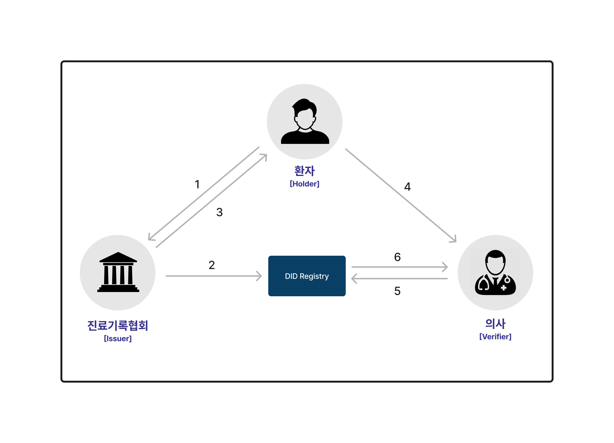

# did-medical-record-management

기존 진료기록에 대한 문제들을 해결하기 위해, DID 기술을 도입하여 진료기록보관과 신원정보의 주권을 개개인에게 부여합니다.

## 관련 페이지

### 배포된 웹 페이지
https://dmrs-b910d.web.app
### 클라이언트 레포지토리
https://github.com/sjhong98/did-client-web
### 프로젝트 설명 페이지
https://bit.ly/viviviviviid-dmrs

## 용어정리

- DID (탈중앙화 신원증명 : Decentralized Identity)
    - 개인의 데이터를 중앙화된 기관을 거치지 않으면서도 검증이 가능하게 하는 개념.
    - [W3C DID Spec](https://www.w3.org/TR/did-core/)

- Claim
    - 전체데이터의 각 단위 데이터 입니다.
    - 예를 들어 디지털 신원 정보에서 이름, 생년월일, 성별 등과 각각의 값을 페어로 claim이라 불림.
    - [W3C VC Claims](https://www.w3.org/TR/vc-data-model/#claims)

- Verifiable Credential (VC)
    - 발급자, 유효기한, 검증에 사용되는 발급자의 공개키 등과  claim 의 집합과 서명을 포함하는 검증 가능한 Credential 입니다.
    - 위변조가 불가능하며 예로 휴대폰본인인증, 전자신분증 등 신원인증이 있습니다.
    - 발급자가 사용자의 정보를 인증하여 발급하고 사용자에게 전달됩니다.
    - [W3C VC Credential](https://www.w3.org/TR/vc-data-model/#credentials)
    
- Verifiable Presentation (VP)
    - 하나 이상의 Verifiable Credential 과 소유자의 공개키와 서명을 포함하는 검증 가능한 Presentation 입니다.
    - 소유자가 발급자에게서 발급 받은 credential 을 검증자에게 제출 시 사용됩니다.
    - [W3C VC Presentation](https://www.w3.org/TR/vc-data-model/#presentations)

## DID Workflow

1. 환자는 진료기록협회에 VC 발급 요청을 합니다.
2. 협회는 DID Registry 컨트랙트의 VC 발급 함수를 호출하여, 블록체인 상에 협회가 환자 이름의 VC를 발급했다는 사실을 기록합니다.
3. 환자에게 VC를 전달합니다.
4. 환자는 공유하고 싶은 VC들을 선택하여 VP로 변환시킨 후, 의사에게 QR코드의 형태로 VP를 전달합니다.
5. 의사는 VP가 유효한지 확인하기 위해, DID Registry 컨트랙트의 VP 검증 함수를 호출합니다.
6. 의사는 컨트랙트의 반환값으로 VP 유효성 검사 결과를 받습니다.
7. 이때 6번의 값이 참이라면, VP를 복호화하여 의사의 화면에 환자의 신원정보와 진료기록들을 띄워주게 됩니다.